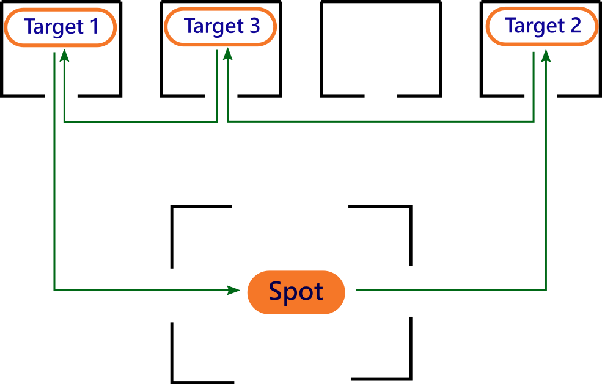
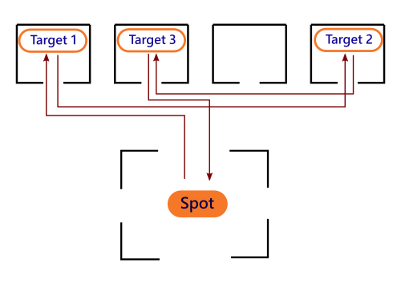

# MCI_Spot_PostDog
Das Projekt "MCI Spot PostDog" ist ein Projekt des Medizintechnik Departments des MCI und einer eigens für den Boston Dynamics Spot Robotdog geschaffenen Usergroup. Ziel des Porjekts ist, dass sich der Spot Robot optimale Laufwege in einem vorher bekanntem Gebäude errechnet und diesen folgen kann. In einem weiteren Schritt sollte es dem Spot dann möglich sein bestimmte Waren oder ähnliches in diese Räume zu bringen.
## Aufteilung
Im Projekt werden mehrere programmiertechnische Disziplinen kombiniert. Hierfür sind unterschiedliche Teilaufgaben zu erledigen. 
### Mapping
Um zu wissen welche Laufwege möglich sind muss der Roboter sich zuvor ein Bild der Räume gemacht haben. Das Erstellen solche Raumkarten wird "Mapping" genannt. Über einen Sensor (Lidar, Kamera, Ultraschall, etc..) können mit den richtigen Algortihmen umliegende Wände, Gegenstände, Personen, etc erkannt werden. Diese Informationen müssen einmal erstellt und dann langfristig im Roboter gespeichert werden. Fragen hier wären:
- Wie speichert man die Informationen dauerthaft im Roboter ? 
- Werden die Räume mit speziellen Markierungen versehen ? 
- Welche Anforderungen etc muss ein solcher Raum erfüllen ? 
### Computer Vision
Um Mapping Daten zu verarbeiten aber auch um Zusatzfunktionen wie zum Beispiel dem Erkennen einer Paketzuschrift oder bestimmter Makierungen sind Algorithmen zur Bildverarbeitung notwendig. Fragen hier wären:
- Welche Kamera wird verwendet ?
- Welche Funktionen werden wie implementiert ? 
### Trajektorienfindung
Das Finden des schnellsten Weges bei einer Vielzahl von möglichen Wegvariationen wird in der Informatik allgemein als Graphentheorie bezeichnet. Während für drei Targets die Trajektorienfindung noch einfach scheint, kann diese in komplexeren Gebäuden und mehreren Zielen bereits eine Herausforderung sein. In den Bildern ist der Unterschied zwischen guter und schlechter Trajektorienplannung zu sehen.

## Arbeitsaufteilung
Die Arbeit kann nach dem aktuellen Stand wie folgt aussehen

**Serielle Kommunikation**
- Ansteuerung des Spots verstehen und Testen
- Abläufe und Funktionen von ROS verstehen
- Benötigte Sensoren und Aktoren ansteuern bzw. Programme zu deren Ansteuerung erstellen
- Schnittstellen Funktionen überlegen und evt. grobe Gedanken über Programm Struktur

**Computer Vision**
- Algorithmen zum Auslesen bestimmter Markierungen researchen und testen
- Markierungen erstellen und deren Bedeutung implementieren

**Mapping**
- Literatur Research Mapping und Methoden hierfür
- Bestimmen des Sensors der für das Mapping verwendet werden soll. Grundsätzlich steht hier wsh die Wahl zwischen Lidar und 3D Cam
- Erstellen leichter Testszenarien und Implementierung der hierfür notwendigen Algorithmen

**Trajektorienfindung**
- Literatur research für Laufwegplannung bei Robotern
- Algorithmen zum Thema Graphentheorie verstehen
- Einfache Testszenarien auswerten und optimieren
